# 📦 SchedulerX

**SchedulerX** is a modular automation engine for ingesting, transforming, and scheduling social media content — starting with TikTok. This CLI-based system converts local `.appdata` files into a PostgreSQL-backed pipeline with full Prisma ORM integration.

---

## 🔁 Pipeline Flowchart

```mermaid
graph TD
    A[Start: run_all.py] --> B[0copy_appdata.py<br>📁 Copy .appdata folder]
    B --> C[1generate_md.py<br>📝 Generate summary.md]
    C --> D[2decode.py<br>🔓 Decode Base64 to JSON]
    D --> E[3xlsx.py<br>📊 Create Excel from JSON]
    E --> F[4append_consolidated.py<br>🧩 Consolidate data]
    F --> G[5import_db.py<br>🗄 Import to PostgreSQL]
    G --> H[6prisma_sync.py<br>🚀 Sync + Launch Prisma Studio]
    H --> Z[End]
```



---

## 🧰 Tech Stack

| Component      | Stack                               |
|----------------|--------------------------------------|
| UI (planned)   | Next.js + Tailwind + ShadCN          |
| Backend API    | Flask + APScheduler                  |
| Database       | PostgreSQL + Prisma                  |
| Storage        | Cloudflare R2                        |
| Scheduler      | APScheduler / Supabase CRON          |
| API Clients    | Python SDKs (Pinterest, TikTok, IG)  |

---

## 🚀 Getting Started

### Step 1: Clone + Install
```bash
git clone https://github.com/Jax-Baiya/tt_automata.git
cd tt_automata
pip install -r requirements.txt
```

### Step 2: Run Pipeline
```bash
python3 run_all.py
```

You'll be prompted to provide paths, filenames, and DB info (or prefill them in `session.json`).

---

## 🖥️ Executable CLI Versions (SchedulerX)

### 🐧 Linux / macOS

You can run the pipeline with a simple shell wrapper:

```bash
bash schedulerx.sh
```

To install it globally as `schedulerx`:

```bash
mv schedulerx.sh ~/.local/bin/schedulerx
chmod +x ~/.local/bin/schedulerx
echo 'export PATH="$HOME/.local/bin:$PATH"' >> ~/.bashrc
source ~/.bashrc
```

Then run from anywhere:
```bash
schedulerx
```

---

### 🪟 Windows

1. Install [PyInstaller](https://pyinstaller.org/):
```bash
pip install pyinstaller
```

2. Build the executable:
```bash
pyinstaller schedulerx.spec
```

3. Run the `.exe`:
```bash
dist/schedulerx/schedulerx.exe
```

---

## 🧭 Roadmap

See [ROADMAP.md](./ROADMAP.md) for upcoming features like:
- Dashboard UI
- Cloudflare R2 media upload
- Post scheduling to TikTok, Pinterest, and IG

---
· MIT License


Built by [Jax-Baiya](https://github.com/Jax-Baiya) 